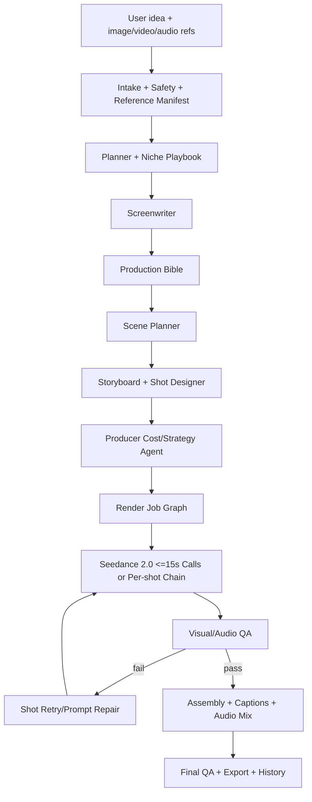

# CineJelly Autonomous Agent Blueprint

Updated: 2026-05-31

This document audits the current CineForge Studio codebase after the
Autonomous-only refactor and defines the next production roadmap for turning it
into a top-tier Seedance 2.0 autonomous video agent.

## Current Verdict

CineJelly is now a strong autonomous-video foundation, but it is not yet at the
level of the best Chinese/agentic AI video production systems. It has the right
direction: one-click UI, modular skills, production bible, multimodal references,
long-form scene planning, market playbooks, and render QA metadata. The missing
layer is production-grade orchestration: persistent job graph, automatic
shot-level retry execution, persistent assets, budget-aware production control,
and full script-to-scene-to-chunk continuity for 5-30 minute films.

In practical terms:

- 15-60s social/product/UGC videos: close to usable production workflow, but
  rendered as multiple 4-15s model calls rather than one long Seedance request.
- 1-3m micro films: structurally supported, needs stronger QA and retry.
- 5m short films: planning exists, render orchestration is still too linear.
- 30m episodes: conceptually mapped, but needs queue/chunk graph before real use.

The product should be positioned as autonomous-first, not model-picker-first.
The user should provide idea + references + optional runtime/market; the agent
should act as director, producer, screenwriter, cinematographer, editor, and QA
supervisor.

## Current Autonomous Workflow

1. User enters one idea on `/studio`.
2. User optionally chooses target runtime and target market:
   - `Auto` keeps the experience one-click.
   - `VN`, `US`, `SEA`, `JP`, `KR`, and `Global` guide localization, dialogue,
     hook phrasing, social proof, and captions.
3. User optionally uploads multimodal references:
   - up to 9 images
   - up to 3 videos
   - up to 3 audio files
   - up to 12 mixed files total
4. Frontend calls `POST /api/v1/director/autonomous`.
5. Backend runs:
   - Planner: decides niche, hook, style, target duration.
   - Target Market: localizes story logic, dialogue, caption, and cultural cues.
   - Niche Playbook: injects niche-specific camera/audio/beat rules.
   - Runtime Structure: classifies short, sequence, micro film, short film, episode.
   - Role Tagger: tags image/video/audio roles.
   - Storyboard: creates beat panels.
   - Long-form Scene Planner: for >180s, splits into scene blueprints.
   - Director: converts storyboard into renderable shots.
   - Editor: caption, hashtags, hook, transitions.
6. AutonomousDirector builds a DirectorPlan with Production Bible.
7. VideoWorker renders:
   - Seedance 2.0 single-call multi-shot for suitable short clips.
   - per-shot reference chaining for long/cross-location/fallback paths.
8. AssembleWorker concatenates clips, applies color pass, uploads result.
9. JobResultModal shows status/result.
10. Render quality metadata is attached for future QA/retry.

## Current Code Anchors

- UI: `app/studio/page.tsx`
- Autonomous chain: `backend/agent/autonomous_director.py`
- Reference manifest: `backend/agent/reference_manifest.py`
- Long-form structure: `backend/agent/long_form_orchestrator.py`
- Scene blueprints: `backend/agent/scene_planner.py`
- Screenplay planning: `backend/agent/screenplay_planner.py`
- Production graph: `backend/agent/production_graph.py`
- Producer strategy: `backend/agent/producer_strategy.py`
- Asset memory bridge: `backend/agent/asset_memory.py`
- Production artifact snapshots: `backend/core/production_artifacts.py`
- Niche rules: `backend/skills/niche_playbooks.py`
- Market rules: `backend/skills/market_playbooks.py`
- Niche benchmark cases: `backend/skills/niche_benchmarks.py`
- Scene prompt builder: `backend/agent/scene_generation_agent.py`
- Seedance multi-shot prompt: `backend/agent/multi_shot_prompt_builder.py`
- Render worker: `backend/workers/video_worker.py`
- QA metadata: `backend/agent/render_quality_gate.py`
- Technical/visual QA probes: `backend/agent/media_quality_probe.py`
- Semantic vision QA: `backend/agent/semantic_quality_evaluator.py`
- Retry planning: `backend/agent/render_retry_planner.py`
- Safe retry execution: `backend/agent/render_retry_executor.py`

## Seedance 2.0 Capabilities To Exploit

Based on current official/near-official docs and provider docs:

- Unified multimodal audio-video model.
- Text, image, video, and audio inputs.
- Up to 9 reference images.
- Up to 3 reference videos.
- Up to 3 reference audios.
- Mixed input cap around 12 media files.
- Per-generation duration is 4-15 seconds.
- Output can include generated/synchronized audio.
- Reference videos can transfer camera movement, motion rhythm, and edits.
- Audio references can guide rhythm, narration, beat-matched motion, and lip sync.
- Strongest workflow is Universal/Omni Reference with explicit reference binding:
  image for identity/product/style, video for camera/motion, audio for rhythm/SFX.

Sources:

- https://seed.bytedance.com/en/seedance2_0
- https://docs.together.ai/docs/seedance2.0-quickstart
- https://www.seedvideo.net/docs/seedance-2-parameters
- https://www.seedancetwo.com/manual
- https://help.artlist.io/hc/en-us/articles/35245474706333-Seedance-2-0
- https://arxiv.org/abs/2604.14148

## Best External Patterns To Borrow

### Jellyfish

Repo: https://github.com/Forget-C/Jellyfish

What to borrow:

- Asset management as a first-class system.
- Character, scene, prop, costume, dialogue extraction.
- Shot/task tracking with cancel/recovery.
- Reusable prompt and generation assets.

Why it matters:

Long videos fail mostly because assets drift. CineJelly needs a persistent
asset library, not just uploaded refs per run.

### ViMax

Repo/search: https://github.com/HKUDS/AI-Creator

What to borrow:

- Idea2Video, Script2Video, Novel2Video modes at backend level.
- Separate Screenwriter, Storyboard, Shot Designer, Producer, Video Generator.
- Long-script segmentation and multi-camera filming simulation.
- Consistency validation before generation.

Why it matters:

CineJelly currently has a good autonomous chain, but needs a stronger
screenplay/script layer for 5-30 minute content.

### MovieAgent

Repo: https://github.com/showlab/MovieAgent
Paper: https://arxiv.org/abs/2503.07314

What to borrow:

- Hierarchical multi-agent CoT planning.
- Script + character bank as the long-form foundation.
- Scene, camera, cinematography, location coordination.
- Stable subtitles/audio throughout long-form video.

Why it matters:

Long-form video should not start from a shot list directly. It should start
from logline -> treatment -> screenplay -> scenes -> shots -> clips.

### OpenStory

Site: https://openstory.so/

What to borrow:

- User idea or full script becomes scenes, characters, shots, soundtrack.
- User can define look, cast, locations once.
- Generate and refine per shot.
- Export all prompts, shots, sequences, and music.

Why it matters:

CineJelly should save every internal artifact so users can inspect, regenerate,
or reuse the production.

### Codeywood

Site: https://codeywood.com/
Repo: https://github.com/kaigani/codeywood

What to borrow:

- Skill-based story pipeline.
- Sparse user input expanded into episodic content.
- Quality gates after each skill.
- Reference-based consistency over hundreds of shots.

Why it matters:

Your existing modular skills are aligned with this pattern. The next step is
quality gates and persistent artifacts between skills.

### OpenMontage

Repo: https://github.com/calesthio/OpenMontage

What to borrow:

- Multi-point final QA: ffprobe validation, frame sampling, audio level checks,
  subtitle checks, delivery-promise verification.
- Retrieval-first B-roll/documentary workflow from stock/open archives.
- Remotion-style composition and captions.

Why it matters:

For education/documentary/news/product explainers, real footage retrieval can
beat fully generated footage and reduce cost.

### Current Research To Track

- Script-to-cinematic generation: https://arxiv.org/abs/2601.17737
- Camera Artist: https://arxiv.org/abs/2604.09195
- CANVAS storyboard continuity: https://arxiv.org/abs/2604.13452
- DreamShot storyboard synthesis: https://arxiv.org/abs/2604.17195
- Co-Director: https://arxiv.org/abs/2604.24842
- MAViS long-sequence storytelling: https://aclanthology.org/2026.eacl-long.101.pdf

## Niche Readiness

High readiness now:

- UGC review
- beauty
- food
- tech/product demo
- lifestyle
- fashion
- ASMR

Medium readiness:

- drama/short film
- education/explainer
- automotive
- fitness
- documentary/news
- real estate
- ecommerce catalog
- music video
- anime/comic adaptation
- app/SaaS demo
- restaurant/hospitality
- travel
- gaming
- finance/education
- medical/wellness
- kids/family

Needs additional product logic:

- ecommerce catalog at scale with batch SKU memory
- documentary/news with retrieval/footage citation
- regulated medical/legal/financial review workflow
- medical/legal/financial explainers
- children/family content

## Market Readiness

Currently implemented:

- `auto`: infer language and market from idea/references.
- `vn`: Vietnamese-first captions, natural creator speech, local social proof.
- `us`: direct English hooks, proof-first claims, creator-native phrasing.
- `sea`: warm practical mobile-commerce framing.
- `jp`: restrained quality/ritual cues, polite phrasing, no loud hype.
- `kr`: polished beauty/lifestyle pacing and trend-aware reveal.
- `global`: simple English, minimal slang, internationally readable scenes.

Next step:

- Convert these into persistent performance playbooks by tracking generated
  videos, QA failures, captions, costs, and manual user ratings per market.

## Model Strategy

Current default stack is appropriate:

- Seedance 2.0 Reference-to-Video: best primary model for quad-modal control.
- Seedance 2.0 Fast Reference-to-Video: best default cost/quality route.
- Seedance 2.0 I2V/T2V variants: useful for single-shot, previous-frame chain,
  or no-reference jobs.
- Wan 2.7 I2V: keep for driven-audio/lip-sync paths, especially Vietnamese
  talking-head style clips with TTS.

Research candidates to test before integrating:

- AtlasCloud InfiniteTalk: priority benchmark for long multilingual
  talking-head/dialogue inserts, especially Vietnamese education, product
  spokesperson, and two-speaker clips.
- AtlasCloud MultiTalk: benchmark as lower-cost multi-person dialogue lane.
- AtlasCloud MMAudio v2: benchmark for post-render ambience, foley, and SFX.
- AtlasCloud/video-upscaler: final polish only after QA passes.
- Bytedance LipSync/Avatar OmniHuman/Instant Character: benchmark for dialogue
  repair, portrait dialogue, and reusable character anchors.
- Kling/Vidu/Wan/Veo-style alternatives: only add behind router after
  benchmark evidence proves a niche where they beat Seedance/Fast/Wan.

Do not add more models to the UI. Add them behind an internal model router only
after benchmark clips prove where each model beats Seedance/Fast/Wan.

Implemented routing contract:

- `backend/agent/dialogue_route_policy.py` now separates cinematic coverage
  from visible speech. Seedance remains the primary visual director.
- No visible dialogue: keep Seedance native/silent and optionally benchmark
  `atlascloud/mmaudio-v2` as a post-render ambience/SFX pass.
- 5-10s visible-face dialogue: route candidate is `wan_2_7_i2v` because it is
  the current driven-audio fallback already available in the stack.
- Long single-speaker presenter/education/explainer inserts: benchmark
  `atlascloud/infinitetalk`; do not auto-route until stored VN/EN output clips
  pass lip-sync, identity, body stability, and cost/minute gates.
- Two-speaker dialogue/drama/interview inserts: benchmark
  `atlascloud/multitalk`; keep Seedance for establishing shots, product hero,
  b-roll, motion, and cinematic scene continuity.
- Post-render dialogue repair: benchmark `bytedance/lipsync/audio-to-video`
  only after the visual clip is already acceptable.

Implemented production-decision preview:

- `POST /api/v1/director/autonomous/production-decision` is a read-only,
  vendor-free endpoint for explaining the intended workflow before a paid
  render starts.
- Input: idea, optional target market/platform/runtime, reference counts,
  optional niche hint, and speaker count.
- Output: inferred niche, readiness, runtime class, graph requirement, primary
  Seedance route, dialogue route policy, Seedance caps, workflow steps, market
  playbook, niche playbook, QA gates, and benchmark requirement.
- This endpoint is useful for UI preflight, admin QA, and future benchmark
  dashboards because it shows how the agent intends to behave without spending
  AtlasCloud credits.

## Required Upgrades

### P0: Make Long-Form Real

Add persistent job graph:

- project
- production_bible
- scenes
- chunks
- shots
- renders
- qa_reports
- retries
- final_assemblies

Each 5-30 minute video must render as a resumable graph of 4-15s model calls,
not one long background function or one long video-model request.

Acceptance gate:

- A 5 minute job can resume after process restart without losing approved
  screenplay, scene, shot, render, QA, and retry state.
- A failed shot retries without regenerating the full video.

### P0: Add Visual/Audio QA Evaluator

The current `render_quality_gate.py` records QA criteria but does not inspect
pixels or audio. Add evaluator stages:

- sample frames with ffmpeg/ffprobe
- check duration/codec/audio stream
- inspect frame identity/product/caption with a vision model
- inspect audio loudness/silence/sync
- compute pass/fail per shot
- retry only failed shots

Current state:

- ffprobe/frame sampling/semantic QA/retry recommendations are present.
- `render_retry_executor.py` now classifies retry items into executable vs
  deferred, avoiding unsafe retries for full-clip/single-call outputs and shots
  that are continuity anchors for later shots.
- `video_worker.render_plan()` can execute one safe pre-assembly retry pass for
  eligible per-shot failures, replace the failed clip, attach retry QA, and
  preserve deferred items for future graph execution.

Still needed:

- multi-attempt retry loop with policy limits per project
- graph-level chunk retry for scene-group/full-clip outputs
- retry-aware re-render of downstream shots when an upstream chain anchor is
  replaced
- UI surface for retry/deferred reasons

### P0: Explicit Seedance Reference Binding

For every generation, create a `reference_manifest`:

- `@image1`: character identity
- `@image2`: product hero
- `@video1`: camera motion
- `@audio1`: rhythm/music/SFX

Then inject the manifest into prompts. This is the most important Seedance 2.0
optimization because the model is strongest when references are assigned clear
roles.

### P1: Strong Screenplay Layer

Before storyboard for long-form:

- logline
- premise
- characters
- world/setting
- act structure
- scene list
- beat sheet
- screenplay/dialogue
- shot list

For 5m, use 3 acts and 5-8 scenes.
For 30m, use 5 acts and 20-30 scenes.

### P1: Asset Memory

Add persistent asset memory:

- characters
- products
- locations
- props
- wardrobe
- voice persona
- reusable reference images/videos/audio

Users should be able to build an ongoing brand/series, not restart every run.

Current state:

- `core/assets_store.py` provides reusable character/product/storyboard assets.
- `agent/asset_memory.py` auto-saves RoleTagger image references into that
  library after autonomous planning, mapping character/product/style/location
  roles into reusable asset types and touching existing assets by URL to avoid
  duplicates.
- New autonomous runs now retrieve ranked prior asset candidates by niche,
  target market, idea tokens, role, and asset type. This is metadata-only:
  candidates are exposed in `asset_memory.suggestions` and production artifacts
  but are not injected into rendering until an explicit future pin/approval step.
- Autonomous responses and production artifact snapshots include
  `asset_memory` metadata.

Still needed:

- UI controls to show which assets were remembered and let users rename/approve.
- Approved pinning of prior assets into new autonomous runs based on
  project/brand.
- Asset-level performance stats and per-series continuity locks.

### P1: Cost-Aware Producer Agent

Before render, estimate:

- number of shots
- <=15s single-call vs per-shot chain
- expected vendor cost
- retry reserve
- estimated wall-clock time

Then choose a render plan that balances quality and cost.

This is mandatory before 5-30 minute production use. A 30 minute Seedance render
can exceed a reasonable consumer budget unless the producer agent uses draft
passes, chunk approval, cheaper fallback models, and retry reserves.

Current state:

- `producer_strategy.py` estimates cost/duration risk.
- Autonomous jobs now enable `draft_first` cost gate for medium/high/very-high
  risk jobs.
- `/studio` shows the producer execution note and top warnings after plan start.
- `backend/core/production_artifacts.py` persists an early JSON snapshot for
  autonomous jobs: request metadata, planner, storyboard, director output, role
  tags, editor preview, continuity bible, shot list, runtime structure,
  production graph, and producer strategy.
- `GET /api/v1/director/jobs/{job_id}/artifact` returns the snapshot for
  debugging, inspection, and future replay/resume tooling.
- `backend/core/production_graph_store.py` persists autonomous production graph
  metadata into SQLite as queryable graph, node, and edge rows. The autonomous
  endpoint stores this graph at job creation and exposes it through
  `GET /api/v1/director/jobs/{job_id}/production-graph`.
- `backend/workers/video_worker.py` now updates persisted graph node status
  during the current linear render: shot nodes move through rendering/rendered,
  QA nodes receive pass/warn/fail/pending-visual statuses, retry attempts mark
  shots as retrying/retry_failed/rendered, and `assembly_final` moves through
  assembling/completed.
- `/director/autonomous` can now route long-form jobs through
  `graph_executor_long_form` when `CINEJELLY_ENABLE_GRAPH_LONG_FORM=1`.
  The flagged path loads the persisted artifact, renders each shot through the
  graph executor, runs strong per-shot QA, and assembles final output. It stays
  off by default until paid AtlasCloud benchmark runs prove quality/cost.

Still needed:

- User/project-level budget caps.
- Real chunk approval/resume for long-form.
- Promote graph executor mode as the default for long-form after paid
  benchmarks, then add chunk-level replacement/downstream chain-anchor repair.
- Separate draft model benchmarks for Seedance Fast, Grok Imagine, Veo Lite,
  Kling, and Wan dialogue-only shots.

### P2: Niche Expansion

Current state:

- `backend/skills/niche_playbooks.py` supports 23 niche keys:
  `anime_comic`, `app_saas`, `asmr`, `automotive`, `beauty`, `documentary`,
  `drama`, `ecommerce_catalog`, `education`, `fashion`, `finance_education`,
  `fitness`, `food`, `gaming`, `kids_family`, `lifestyle`,
  `medical_wellness`, `music_video`, `real_estate`,
  `restaurant_hospitality`, `tech`, `travel`, `ugc_review`.
- `backend/skills/niche_benchmarks.py` contains one canonical smoke case per
  supported niche, including idea, target market, duration, reference strategy,
  and success criteria.
- Regulated/sensitive niches now carry safety rules into the Production Bible:
  documentary, finance education, medical wellness, kids/family.
- `backend/skills/niche_readiness.py` builds a queryable readiness matrix from
  playbooks and benchmark cases. `GET /api/v1/director/autonomous/capabilities`
  returns 23 supported niches, high/medium/review-required readiness buckets,
  runtime support, market support, and model-router recommendations.

Still needed:

- expand each niche from 1 canonical case to 3-5 cases
- add user rating feedback loop
- add per-niche cost and QA failure statistics
- add regulated-content approval gates for finance/medical/legal

Each playbook should define:

- hook grammar
- beat flow
- shot grammar
- camera palette
- reference strategy
- audio strategy
- QA failure modes
- platform variants

### P2: Human Review Optional, Not Required

Keep UI one-click by default, but allow advanced users to inspect:

- script
- scene plan
- shot list
- references
- render QA
- failed retry reasons

This should be collapsible, not manual-mode clutter.

## Target Production Architecture

## Concrete Next Implementation Order

1. Extend the new reference manifest into stored job metadata and UI preview.
2. Persist the new screenplay plan and production graph as first-class production artifacts.
3. Add dedicated project/job graph tables instead of storing graph only inside `DirectorPlan.storytelling_meta`.
4. Move long-form planning/rendering fully into background chunk jobs that execute the production graph.
5. Persist QA scores/retry recommendations and retry plan into dedicated graph tables.
6. Add automatic shot-level retry execution for queued retry plan items.
7. Add asset memory library.
8. Add niche playbook expansion.
9. Add optional inspectable production panel in UI.
10. Add persistent market playbooks so localization goes beyond language:
    country-safe claims, local platform norms, social proof, slang limits,
    posting windows, legal-sensitive wording, and culturally native scene cues.

## Product Standard

CineJelly should behave like:

- Director: understands story, emotion, camera, continuity.
- Producer: manages cost, duration, references, retry, render strategy.
- Screenwriter: expands an idea into script/acts/scenes/dialogue.
- Cinematographer: designs shot language and camera movement.
- Editor: captions, pacing, hashtags, final packaging.
- QA Supervisor: catches drift, failed refs, broken audio, bad captions.

The current code now covers the first version of Director, Producer, Storyboard,
Editor, and Render Worker. The next leap is persistent production orchestration
and real QA/retry.
